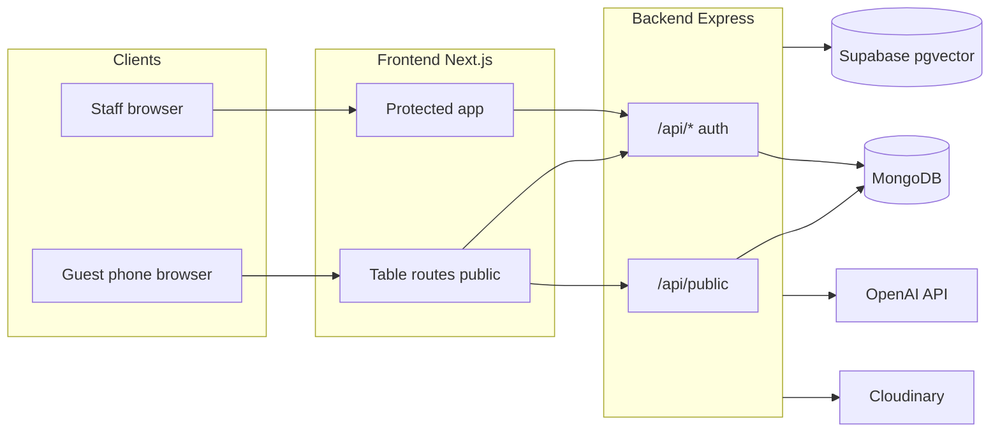
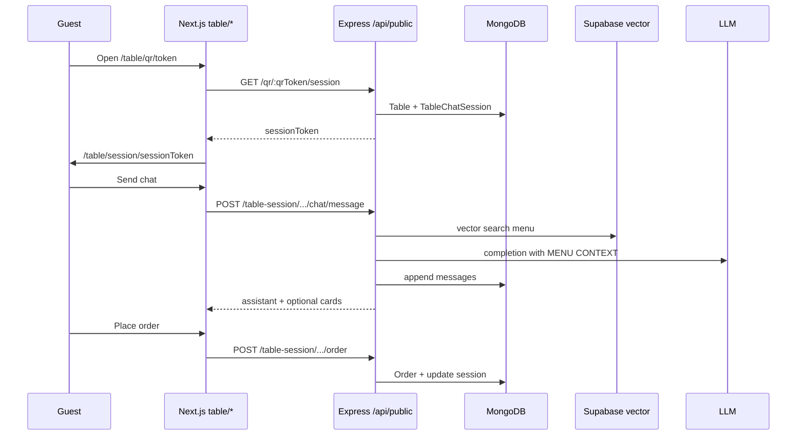

# System architecture

This document describes how the **restaurant-management** monorepo fits together: web apps, API surface, data stores, and the **unified table QR** guest journey (chat + cart + order). For HTTP details, see [api-specs/README.md](api-specs/README.md).

---

## 1. Context

| Piece | Technology | Role |
|--------|------------|------|
| **Guest / table UI** | Next.js (App Router), React | Public routes: `/table/qr/[qrToken]`, `/table/session/[sessionToken]` — menu, AI chat, cart, checkout without login. |
| **Staff / admin UI** | Next.js, Redux (persist) | Authenticated dashboard: menus, tables, orders, AI Studio branding, etc. |
| **API** | Node.js 18+, Express 5, ESM | REST under `/api/*`; JWT/cookie auth for private routes; **no auth** for selected `/api/public/*` guest endpoints. |
| **Primary database** | MongoDB (Mongoose) | Restaurants, users, tables, menu items, orders, bills, **TableChatSession** (guest session state), AI agent config, eval logs. |
| **Menu retrieval (AI)** | Supabase Postgres + **pgvector** (optional) | Embedded menu rows for similarity search; synced from Mongo via `npm run resync:menu-embeddings`. |
| **LLM / embeddings** | OpenAI (or Azure OpenAI per env) | Query clarification, chat completion, text embeddings for RAG. |
| **Media** | Cloudinary | Menu and AI Studio assets (images, optional voucher barcode). |
| **Payments** | Stripe (where configured) | Webhooks use raw body; orders/table session may reference payment intent. |



---

## 2. Repository layout (logical)

```
restaurant-management/
├── backend/src/
│   ├── app.js                 # Express app, route mounting
│   ├── routes/                # REST routers (menu, order, table, public, …)
│   ├── controllers/           # Thin HTTP handlers
│   ├── models/                # Mongoose schemas
│   ├── repositories/          # Table chat session persistence helpers
│   ├── features/ai-studio/    # AI Studio + public table session + chat/RAG services
│   ├── middlewares/           # auth, roles, logger
│   └── utils/                 # QR URL build, tokens, menu field helpers
├── backend/scripts/           # Migrations, backfill QR, resync embeddings, smoke tests
├── frontend/src/
│   ├── app/(table)/           # Guest table QR + session pages
│   ├── app/(protected)/       # Dashboard (auth required)
│   ├── app/(ai-chat)/         # Legacy / redirect helpers for old chat entry paths
│   ├── features/ai-chat/      # ChatShell, theme, scroll, recommendation cards
│   ├── features/ai-studio/    # Design workspace, evaluation panel
│   ├── api/                   # Axios clients (tableSession, menu, …)
│   └── redux/                 # Slices; menu blacklisted from persist (server truth)
└── docs/                      # API specs, RBAC, modules, this file
```

---

## 3. Guest flow: unified table session

**Goal:** One durable **session** per table visit: same `sessionToken` for chat history, cart, and order placement.

1. **Staff** creates a table → API stores **`qrToken`**, builds **`qrLink`** (typically `{Origin}/table/qr/{qrToken}`) and **`qrCode`** PNG. `Origin` comes from the admin browser so LAN vs localhost matches real guest URLs.
2. **Guest** opens QR → Next.js **`/table/qr/[qrToken]`** calls **`GET /api/public/qr/:qrToken/session`** → receives **`sessionToken`**, redirects to **`/table/session/[sessionToken]`**.
3. **Guest app** loads:
   - **`GET /api/public/table-session/:sessionToken`** — cart, order phase, `agentAvailable`
   - **`GET …/agent`** + **`…/conversation`** when AI is on
   - **`POST …/chat/message`** — RAG + LLM (`restaurantChat.service`, `menuRagConfidence.util`)
   - **Cart / order** — `…/cart/*`, `…/order` (see [public-table-session.md](api-specs/public-table-session.md))



**RAG (high level):** Top menu neighbors are always passed to the main reply model; similarity scores are for logging, not gating. **Self-reported allergy** and **ingredient/diet** phrasing in the user text still tighten the system prompt (strict mode). Details: `menuRagConfidence.util.js`, `restaurantChat.service.js`, `backend/.env.example` (`MENU_RAG_DEBUG`).

---

## 4. Staff / authenticated flow

- **Auth:** Login sets **`authToken`** cookie; protected routes use middleware + role checks (`rbac-policy.md`).
- **Tables:** **`/api/tables`** — CRUD, **`POST …/regenerate-qr`** to refresh `qrLink`/`qrCode` after changing how the dashboard is opened.
- **Menu:** **`/api/menuitems`** — CRUD; **`GET /api/menuitems/public`** — guest-safe list for table UI.
- **AI Studio:** **`/api/ai-studio`** — agent theme, assets, provisioning; evaluation endpoints for table chat quality.
- **Orders / bills / payments:** Existing modules; table session **creates orders** linked to the session’s table/restaurant.

---

## 5. Data architecture (simplified)

| Store | Contents |
|-------|-----------|
| **MongoDB** | `Table` (`qrToken`, `qrLink`), `TableChatSession` (`sessionToken`, `messages`, `cart`, `activeOrderId`), `MenuItem`, `Order`, `Restaurant`, `RestaurantAiAgent`, `User`, … |
| **Supabase** | Menu catalog rows + **embedding** column for pgvector similarity (synced from Mongo; not the source of truth for edits). |

**Embeddings pipeline:** Menu changes in Mongo → operators run **`resync:menu-embeddings`** so guest chat retrieval stays aligned (see `backend/scripts/resync-menu-embeddings.mjs`).

---

## 6. Frontend concerns

- **API base URL:** `NEXT_PUBLIC_API_URL` or derived from `window.location.hostname` (same host, port **5000** for backend in dev).
- **Table UI height:** Chat uses flex + `min-h-0` + scroll region so the **composer** stays on screen on mobile (see `ChatShell`, table session page).
- **Redux persist:** **`menu`** slice is **blacklisted** so cached menu rows do not hide new API fields (e.g. ingredients lists).

### Legacy `/ai-chat/*` routes

The Next.js app group **`app/(ai-chat)/`** may still expose URLs such as **`/ai-chat/qr/[qrToken]`** or **`/ai-chat/session/...`** for **redirects or bookmarks**. The **supported** guest path is **`/table/qr/[qrToken]`** → **`/table/session/[sessionToken]`** (see [Public table session](api-specs/public-table-session.md)). Prefer printing and sharing table QRs that use `/table/...` only.

---

## 7. Tooling & configuration

- **[Scripts](scripts.md)** — `npm run` targets (`resync:menu-embeddings`, backfill QR, migrations, eval samples).  
- **[Environment variables](environment.md)** — Backend/frontend env overview; canonical list in `*.env.example`.  
- **Postman:** [Restaurant-Management-APIS.postman_collection.json](Restaurant-Management-APIS.postman_collection.json) — partially maintained; newer flows are also described in `api-specs/` (see folder note in collection).

---

## 8. Deployment notes

- **Backend** listens on **all interfaces** in dev (`0.0.0.0`) for phone testing; configure host/port via env in production.
- **Frontend** `next dev` may set **`allowedDevOrigins`** for HMR from LAN IPs (dev-only; see `next.config.mjs`).
- **Secrets:** Never commit `.env`; use `.env.example` as the checklist (Mongo, JWT, OpenAI/Azure, Supabase, Cloudinary, Stripe).

---

## 9. Related documentation

- [Public Table Session API](api-specs/public-table-session.md)
- [AI Studio API](api-specs/ai-studio.md)
- [Table Management API](api-specs/table.md)
- [Order Management API](api-specs/order.md) (includes table-session checkout)
- [Customer ordering module](customer-ordering-module.md) (legacy + unified narrative)
- [RBAC policy](rbac-policy.md)
- [API specs index](api-specs/README.md)
- [Scripts](scripts.md) · [Environment](environment.md)
